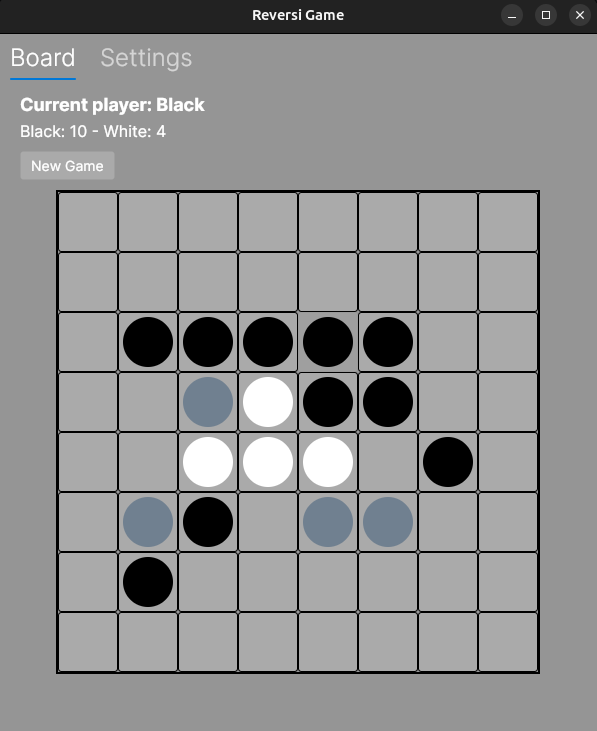
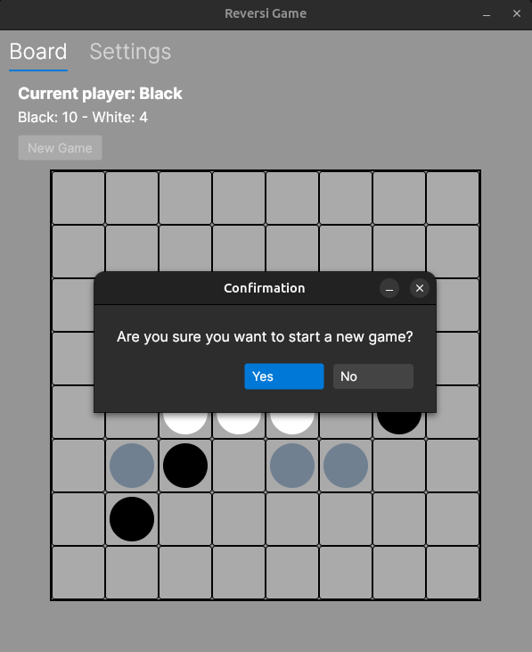
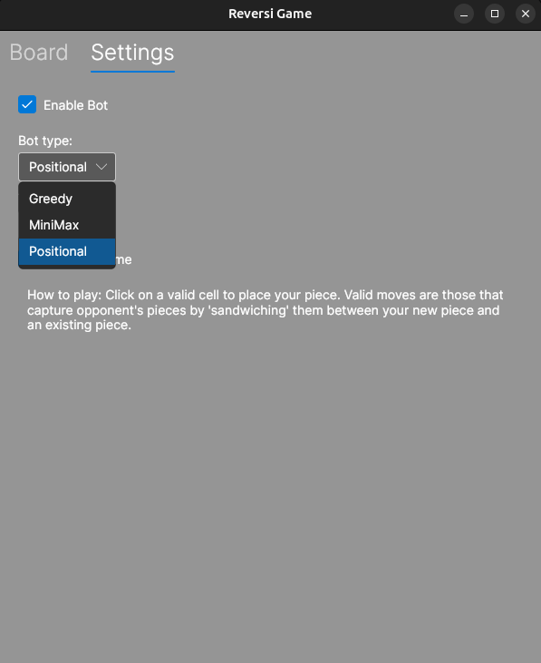
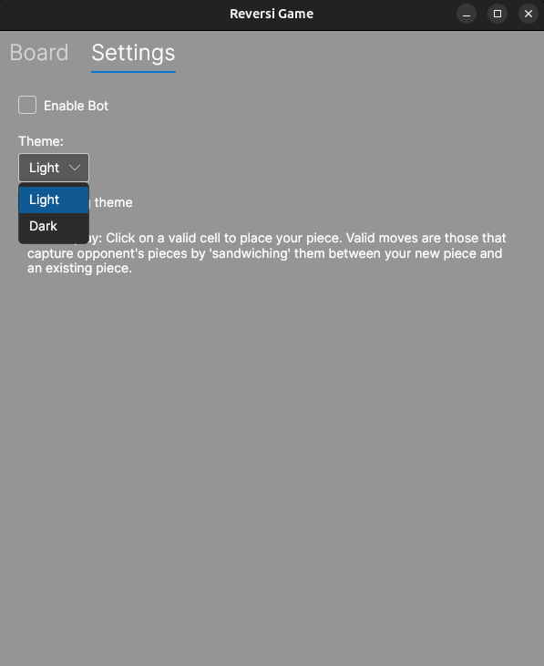

# Project Documentation: Reversi Game

## 1. Project Overview

This project is an implementation of the classic board game "Reversi" (also known as "Othello"). The application features a graphical user interface (GUI) and is developed using the cross-platform framework **Avalonia** with the **C#** programming language.

The project showcases a modern approach to desktop application development using the MVVM (Model-View-ViewModel) pattern, along with the implementation of game logic and bots for playing against the computer.

## 2. Key Features

* **Classic Reversi Gameplay:** The rules of the game on an 8x8 board are fully implemented.
* **Valid Move Highlighting:** The system highlights all possible moves for the current player, simplifying the gameplay.
* **Player vs. Player (PvP) Mode:** The standard mode for two players on the same computer.
* **Player vs. Bot (PvE) Mode:** The ability to play against a computer opponent.
* **Multiple Bot Difficulties:** Includes three different types of bots:
   * **Greedy:** A simple bot that always chooses the move that captures the maximum number of opponent's pieces.
   * **Positional:** A more advanced bot that evaluates moves based on the strategic value of positions on the board (corners and edges are more valuable).
   * **MiniMax:** A classic algorithm for turn-based games that calculates moves several steps ahead to minimize potential losses.
* **Informative Interface:**
   * Displays the current player (Black or White).
   * Shows a piece counter for each player.
   * Includes a "New Game" button with a confirmation dialog.
* **Customizable Themes:** The ability to switch between **Light** and **Dark** interface themes.
* **Cross-Platform:** Thanks to Avalonia, the application can run on Windows, macOS, and Linux.

## 3. Technology Stack

* **Language:** C#
* **Framework:** .NET
* **UI Framework:** Avalonia UI (using XAML for markup)
* **Architectural Pattern:** MVVM (Model-View-ViewModel) using ReactiveUI.

## 4. User Guide

### Gameplay

The interface is divided into two main tabs: **Board** and **Settings**.

#### "Board" Tab

This is the main game screen.

* **Game Board:** An 8x8 grid where black and white pieces are placed.
* **Current Player:** Above the board, the display indicates whose turn it is (`Current player: Black` or `Current player: White`).
* **Score:** The score is displayed below the current player info (`Black: X - White: Y`).
* **Valid Moves:** Cells where a move can be made are highlighted in gray (as shown in the screenshot).
* **How to Make a Move:** Simply click on one of the highlighted cells.
* **New Game:** The `New Game` button allows you to start the game over. A dialog box will appear to confirm your choice.

#### "Settings" Tab

Here you can customize the game to your preferences.

* **Enable Bot:** Check this box to play against the computer.
* **Bot type:** If the bot is enabled, you can choose its strategy from the dropdown list:
   * `Greedy`: For beginners.
   * `Positional`: For a more challenging game.
   * `MiniMax`: For advanced players.
* **Theme:** Choose between `Light` or `Dark` interface themes.

## 5. Project Structure (For Developers)

The project has a clear structure that follows the MVVM pattern:

* **/Models:** Contains the core game logic and data structures.
   * `ReversiGame.cs`: The game's engine. It manages the board state, checks for valid moves, flips pieces, and determines the winner.
   * `Cell.cs`: Represents a single cell on the board and its state (Empty, Black, White, Hint).
   * `Enums.cs`: Enumerations for game state, players, and bot types.

* **/ViewModels:** The "glue" between the Models (data) and the Views (UI).
   * `BoardViewModel.cs`: Manages the logic for the board view, handles cell clicks, and displays the score and current player.
   * `SettingsViewModel.cs`: Manages the state of the settings (theme selection, enabling/disabling the bot, and selecting its type).
   * `MainViewModel.cs`: The main ViewModel that holds the `BoardViewModel` and `SettingsViewModel`.

* **/Views:** Contains the Avalonia XAML markup files that define the application's appearance.
   * `BoardView.axaml`: The UI for the game board.
   * `SettingsView.axaml`: The UI for the settings panel.
   * `MainView.axaml`: The main application window, containing a `TabControl` to switch between `BoardView` and `SettingsView`.

* **/Bots:** Contains the artificial intelligence implementations.
   * `Bot.cs`: An abstract base class for all bots.
   * `GreedyBot.cs`, `PositionalBot.cs`, `MiniMaxBot.cs`: Concrete implementations of the different strategies.

This structure makes the code modular, easily testable, and expandable.